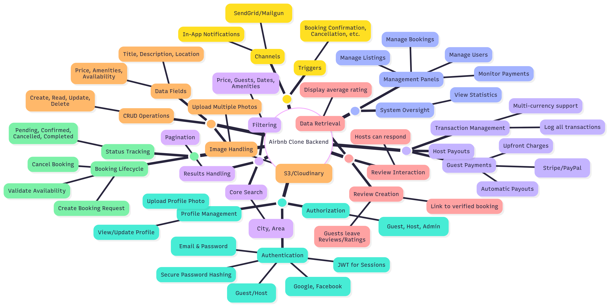

# Airbnb Clone Backend: Features and Functionalities

This document outlines the core features and functionalities required for the backend of the Airbnb Clone project. The features are categorized to provide a clear overview of the system's architecture and capabilities.

## Features Diagram

The following diagram provides a visual representation of all the features and their relationships within the backend system.

## Detailed Feature List

### 1. User Management
- **Authentication:**
  - User registration with roles (Guest, Host).
  - Secure login via email/password and OAuth (Google, Facebook).
  - Session management using JSON Web Tokens (JWT).
- **Profile Management:**
  - Users can view and update their profile information (name, contact info, bio).
  - Ability to upload and change profile photos.
- **Authorization:**
  - Role-Based Access Control (RBAC) to restrict actions based on user roles (Guest, Host, Admin).

### 2. Property Listings Management
- **CRUD Operations:** Hosts can create, read, update, and delete their property listings.
- **Listing Details:** Listings include title, description, location, price, amenities, availability calendar, and property photos.
- **Image Handling:** Support for uploading multiple images per listing, stored in a cloud service like AWS S3.

### 3. Search and Filtering
- **Location-Based Search:** Users can search for properties in a specific city or area.
- **Advanced Filtering:** Results can be filtered by price range, number of guests, available dates, and specific amenities.
- **Pagination:** Search results are paginated to handle large datasets efficiently.

### 4. Booking Management
- **Booking Creation:** Guests can book a property for available dates. The system prevents double-booking.
- **Booking Lifecycle:** Bookings can be canceled by guests or hosts according to defined policies.
- **Status Tracking:** The status of each booking is tracked (e.g., `Pending`, `Confirmed`, `Cancelled`, `Completed`).

### 5. Payment Integration
- **Secure Payments:** Integration with payment gateways like Stripe or PayPal to handle transactions securely.
- **Guest Charges:** Guests are charged upfront for their bookings.
- **Host Payouts:** A system for managing and automating payouts to hosts after a successful stay.
- **Multi-Currency Support:** Ability to handle payments in different currencies.

### 6. Reviews and Ratings
- **Guest Reviews:** After a stay is completed, guests can leave a text review and a star rating for the property.
- **Host Responses:** Hosts can publicly respond to reviews left by guests.
- **Verified Reviews:** Reviews are linked to a confirmed booking to ensure authenticity.

### 7. Notifications System
- **Event-Driven Notifications:** Automated email and in-app notifications are sent for key events.
- **Notification Triggers:** Includes booking confirmations, cancellations, payment updates, and new messages.
- **Third-Party Integration:** Uses email services like SendGrid or Mailgun.

### 8. Admin Dashboard
- **System Oversight:** An admin interface to monitor and manage the platform.
- **Management Capabilities:** Admins can manage users, listings, bookings, and view payment transactions.